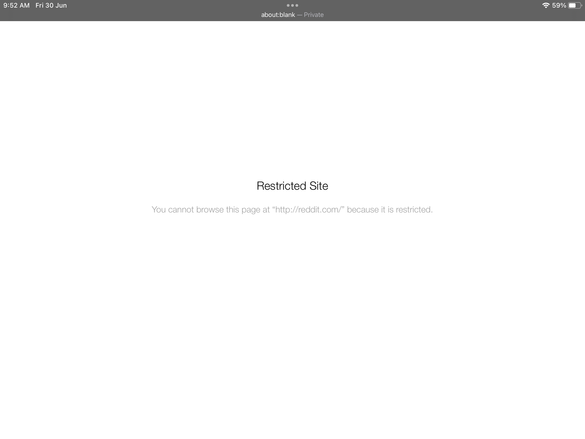
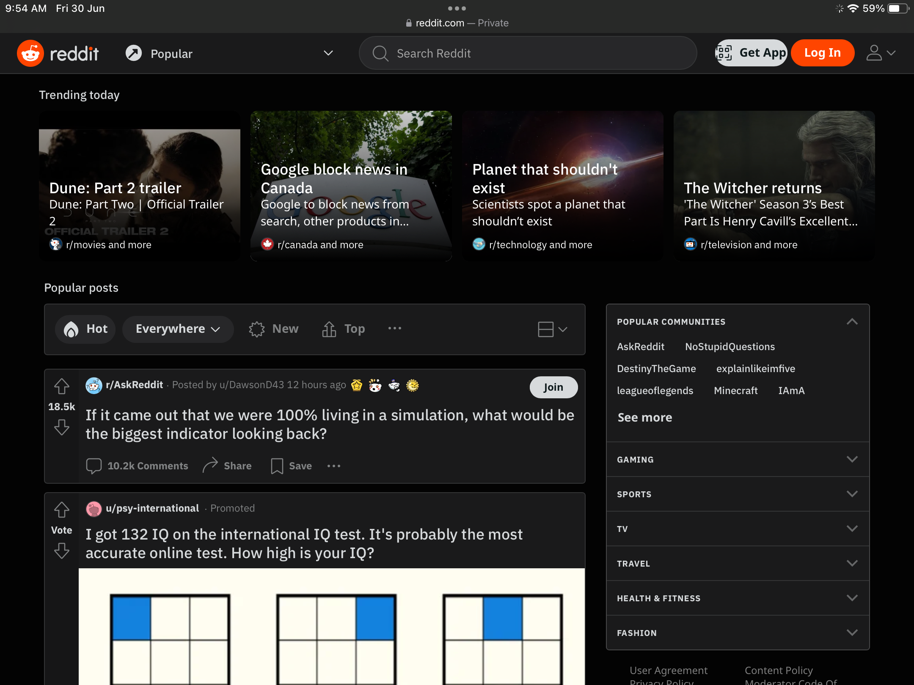

# Bypass project
 
## STATUS

Site is now back online! Please open an issue if all mirrors does not work.

## Mirrors
[Link 1](https://squigglysilentkey.testaccount413.repl.co/bypass)

## About this project

A simple redirector hack that should work on Singapore school iPads that have Mobile Guardian installed.

This is essentially a mobile guardian bypass for school ipads.

THIS WILL ONLY WORK IF THE IPAD SHOWS RESTRICTED ERROR MESSAGE ON THE WEBSITE YOU ARE TRYING TO VISIT.

Examples of the bypass in work

Blocked error page

Bypassed page

## Tested devices

iPad OS 16.2.1 with mobile guardian installed on Safari 

## How do I use it?

Simply open one of the urls in the [mirrors](https://github.com/molangning/bypass#mirrors) section

Do remember to bookmark this github repository for the newest mirrors

For hosting on replit, please fork this repository, import it into replit with the forked repository and set the language the PHP CLI

For self hosting or hosting on other services, please make sure that it is running Linux. I don't want to port it to windows cause it sucks.

## Bypass is restricted

Please open a issue with a screenshot of the resticted page and the name of your school, as the block may just be for your school or countrywide.

## I have found problems in the code/website or I want to suggest something.

If you have found bugs in the code, please feel free to open a issue in the github repo.
For suggestions, make sure you tag them as suggestions in github issues

## TODO
- [x] Hidden links to prevent automatic detection
